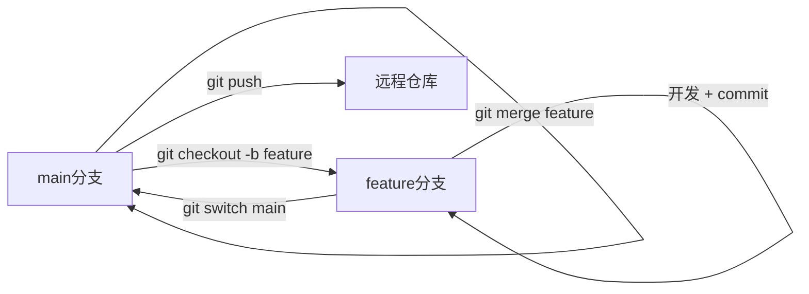

# Git 分支常用指令参考

## 1. 查看分支

| 指令 | 作用 |
|------|------|
| `git branch` | 列出本地分支，当前分支前有 `*` |
| `git branch -v` | 列出本地分支及最近一次提交 |
| `git branch -a` | 列出本地 + 远程所有分支 |
| `git branch -r` | 仅列出远程分支 |
| `git branch --merged` | 已合并到当前分支的分支 |
| `git branch --no-merged` | 尚未合并到当前分支的分支 |
| `git status` | 查看当前所在分支及工作区状态 |

---

## 2. 创建分支

| 指令 | 作用 |
|------|------|
| `git branch <分支名>` | 创建新分支（不切换） |
| `git checkout -b <分支名>` | 创建并切换到新分支（传统写法） |
| `git switch -c <分支名>` | 创建并切换到新分支（Git 2.23+ 推荐） |
| `git branch <新名> <起点>` | 从指定 commit/分支/tag 创建分支 |

**示例：**

```bash
git branch feature/login          # 从当前 HEAD 创建
git checkout -b feature/login       # 创建并切换
git switch -c feature/login main    # 从 main 创建并切换
```

---

## 3. 切换分支

| 指令 | 作用 |
|------|------|
| `git checkout <分支名>` | 切换到指定分支（传统写法） |
| `git switch <分支名>` | 切换到指定分支（Git 2.23+ 推荐） |
| `git checkout -` | 切换到上一个分支 |
| `git switch -` | 切换到上一个分支 |

**注意：** 切换前需保证工作区干净，或有未提交改动时 Git 允许携带改动切换（无冲突时）。

---

## 4. 合并分支

| 指令 | 作用 |
|------|------|
| `git merge <分支名>` | 将指定分支合并到**当前**分支 |
| `git merge --no-ff <分支名>` | 非快进合并，保留合并 commit |
| `git merge --abort` | 合并冲突时放弃合并，回到合并前状态 |

**典型流程：**

```bash
git switch main
git merge feature/login    # 把 feature/login 合入 main
```

---

## 5. 变基（Rebase）

| 指令 | 作用 |
|------|------|
| `git rebase <目标分支>` | 把当前分支的 commit 挪到目标分支之上 |
| `git rebase -i HEAD~n` | 交互式变基，可 squash/edit/reorder |
| `git rebase --abort` | 放弃变基 |
| `git rebase --continue` | 解决冲突后继续变基 |

**与 merge 的区别：**

- `merge`：保留分支历史，产生合并 commit
- `rebase`：线性历史，更整洁，但会改写 commit 历史（**不要对已 push 的公共分支 rebase**）

---

## 6. 删除与重命名

| 指令 | 作用 |
|------|------|
| `git branch -d <分支名>` | 删除已合并的本地分支（安全删除） |
| `git branch -D <分支名>` | 强制删除本地分支（未合并也删） |
| `git branch -m <旧名> <新名>` | 重命名分支 |
| `git branch -m <新名>` | 重命名当前分支 |

---

## 7. 远程分支

| 指令 | 作用 |
|------|------|
| `git fetch` | 从远程拉取最新分支/commit（不合并） |
| `git fetch origin` | 从 origin 拉取 |
| `git fetch --prune` | 拉取并清理已删除的远程分支引用 |
| `git push -u origin <分支名>` | 推送并建立 upstream 跟踪 |
| `git push origin --delete <分支名>` | 删除远程分支 |
| `git branch -u origin/<分支名>` | 设置当前分支跟踪远程分支 |
| `git pull` | fetch + merge（拉取并合并远程更新） |
| `git pull --rebase` | fetch + rebase |

**查看跟踪关系：**

```bash
git branch -vv    # 显示本地分支及其跟踪的远程分支
```

---

## 8. 分支对比与日志

| 指令 | 作用 |
|------|------|
| `git log --oneline --graph --all` | 图形化查看所有分支历史 |
| `git log main..feature` | 查看 feature 有而 main 没有的 commit |
| `git diff main..feature` | 对比两分支代码差异 |
| `git show-branch` | 显示分支分叉关系 |

---

## 9. 暂存与恢复（跨分支常用）

| 指令 | 作用 |
|------|------|
| `git stash` | 暂存当前改动 |
| `git stash pop` | 恢复暂存并删除 stash |
| `git stash list` | 查看 stash 列表 |

切换分支前若有未提交改动，可先 `git stash`，切换后再 `git stash pop`。

---

## 10. 常见工作流示意



**Feature 分支典型流程：**

1. `git switch main && git pull` — 更新主分支
2. `git switch -c feature/xxx` — 创建功能分支
3. 开发、提交 commit
4. `git switch main && git merge feature/xxx` — 合并回主分支
5. `git branch -d feature/xxx` — 删除本地功能分支
6. `git push origin --delete feature/xxx` — 可选，删除远程功能分支

---

## 11. 新旧指令对照（Git 2.23+）

Git 2.23 起，`switch` 和 `restore` 从 `checkout` 中拆分出来，语义更清晰：

| 旧指令 | 新指令 | 用途 |
|--------|--------|------|
| `git checkout <分支>` | `git switch <分支>` | 切换分支 |
| `git checkout -b <分支>` | `git switch -c <分支>` | 创建并切换 |
| `git checkout -- <文件>` | `git restore <文件>` | 恢复文件 |

两者目前都可用，`switch` 更不易误操作。

---

## 12. 在本项目中练习

本仓库已是 Git 仓库，可在项目根目录直接练习：

```bash
git branch                    # 看当前有哪些分支
git status                    # 看当前在哪个分支
git switch -c practice-branch # 创建练习分支
# ... 做一些改动 ...
git add . && git commit -m "练习提交"
git switch main
git merge practice-branch
git branch -d practice-branch
```
